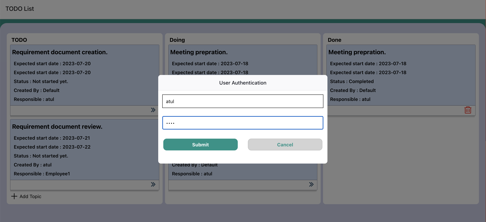
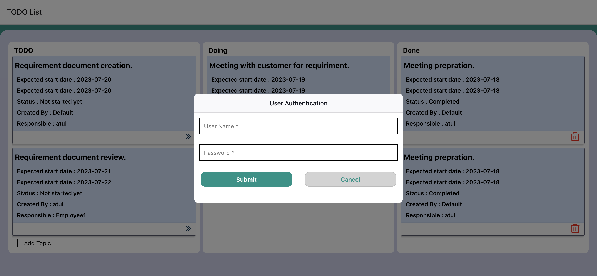

# TODO Management
TODO list management application using React Native and Expo.

Right now, we're making new topics/tasks and updating their status as "Doing," "Done," or "Delete" for completed tasks. This helps us stay organized and efficient in our work.

We can add a priority system for topics/tasks, making it easier to manage them based on their importance. Additionally, we'll be able to identify and address any delays.

Also, we can enhance by analyzing and graphically representing the number of tasks created and completed over time. This will provide valuable insights into project progress and efficiency.

## Requirements
1. npm version - 7.19.1
2. React-Native version - 0.72.3
3. React version - 18.2.0
4. EXPO - 42.0.1

## Application setup
1. Download source code from GitHub.
2. Unzip downloaded zip file.
3. Open command prompt.
4. Go to extracted project folder.
5. To download required libraries execute below command on commant prompt.
   
   npm install --force 
7. To run application, execute below command on commant prompt.
   
   npm start
   
## How to use application
### Default landing page of application

### Add new Topic in TODO list

### Start working on Task/Topic

### Finish working on Task/Topic

### Remove Task/Topic

## Default data setting
Modify default TODO list, Doing list, Done list and user id details in Data.js file.

